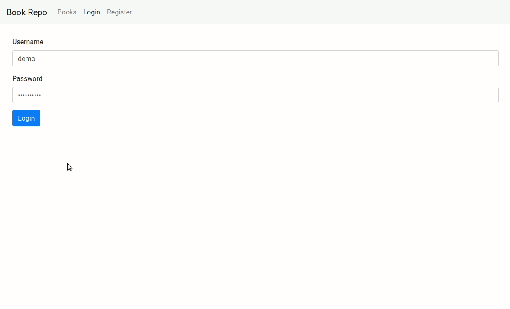

# Book Repo
### React portfolio

Back and front end app that records books. 

Back features:

- Django Rest Framework API
- MongoDB database with Djongo
- API permissions and authorizations
- API token access with simpleJWT  
- API calls with Axios (CRUD, login, registration)

Front freatures:

- JWT Token handling (HTTP headers for login and permisions)
- React Hooks and reusable code
- Routing (Protected routes, redirection after login, etc.)
- Pagination, filtering, sorting, searching.
- Forms validation with Joi

Deployed version: https://stormy-bastion-60347.herokuapp.com
It will take some time to load the first time due to server limitations.
